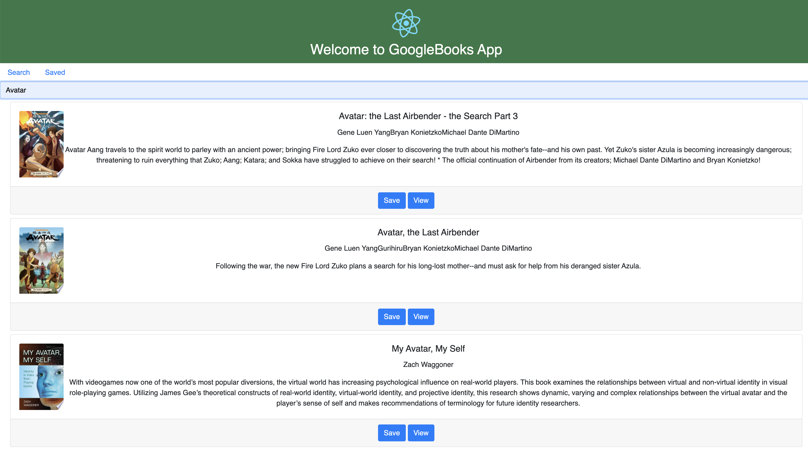
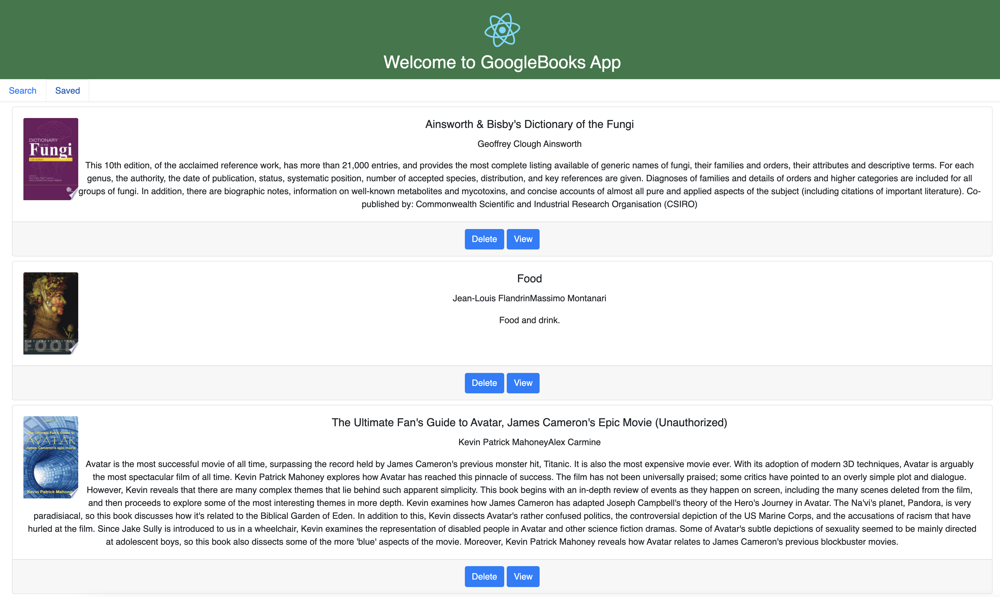

# googlebooks-api

## Description
   This is a MERN app that is connected to Google Books API. It allows the user to search and save books. 

  ## Table of Contents:
  * [Techs](#Techs)
  * [Links](#Links)
  * [Installation](#Installation)
  * [Usage](#usage)
  * [Screenshots](#Screenshots)
  * [License](#license)
  
  
  ## Techs
  Mongoose, Mongo, Express, React, React-bootstrap, Nodejs, Dotenv, [GoogleBooks API](https://developers.google.com/books/)  
  
  ## Links
  [Repo on GitHub](https://github.com/samergain/googlebooks-api/)  
  [Heroku Deployed App](https://googlebooks-api-samer.herokuapp.com/) 

  ## Installation
  To run the app on your local computer you'll need to have Mongo, React, Nodejs installed. Download the project -> make sure mongo is running -> run npm i inside the project root. 
  
  ## Usage
  The interface has two tabs (search, saved).  
  In search page, search for books and click save on books of interest. click view to see the book on GoogleBooks.  
  In Saved page, you'll see a list of the books saved with an option to delete any of them or to view the book on GoogleBooks.
  You can try the app on heroku here: [Heroku Deployed App](https://googlebooks-api-samer.herokuapp.com/).   
  
  ## Screenshots
  
  
 
  
  ## License
  None
